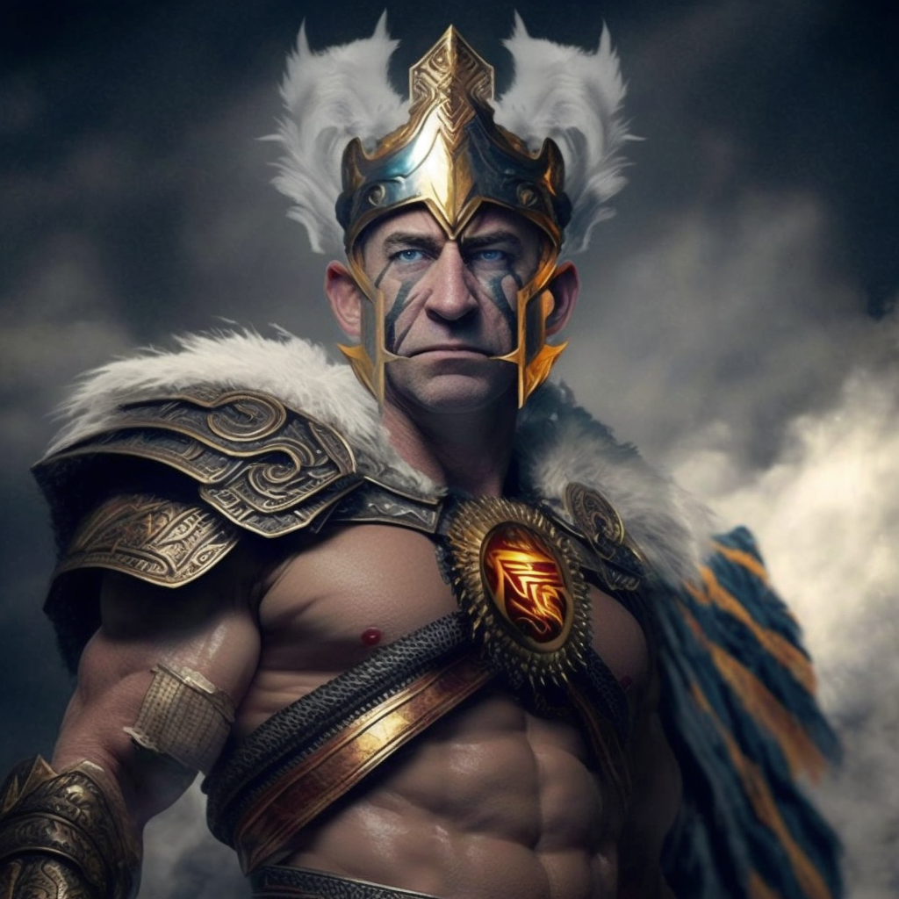

  
   
  <em>Midjourney prompt: "Jeff Bezos as Ares, the god of war"</em>

---
*****_NOTE: This is no longer maintained. We did this years ago and haven't touched it since. There is no guarantee that this will work, be safe, or not charge you exorbitant amounts of money by accident. USE AT YOUR OWN RISK._*****

# Ares
High-impact, high-efficiency password cracking using GPUs in AWS. The best part? It's open-source.

We presented this at BSides ATL 2020. View the demo here: [Demo](https://www.youtube.com/watch?v=5wx5UH3fODI)

## What does it do?
The goal of this project was to create and easy and cost-efficient way to crack passwords using
GPU-heavy EC2 instances. By using spot instances and Lambda/CDK, we can run all of this from
a Python script.

## Prerequisites
1. An AWS account
2. Permission from AWS to use p3 instances
3. A connected payment method
4. Our custom AMI

## Associated Projects
* [masker.py](https://github.com/r3s-ryan/masker)

## Necessary installations and configurations
## OS
`sudo apt-get update && sudo apt-get install hashcat make gcc wget`

## Nvidia drivers:
`sudo /bin/bash /home/ubuntu/cracking/drivers/NVIDIA-Linux-x86_64-410.72.run --ui=none --no-questions --silent -X && sudo nvidia-smi`

## Run receive script for cron at boot
`@reboot sudo python3 /home/ubuntu/sqs-receive-message.py &`
